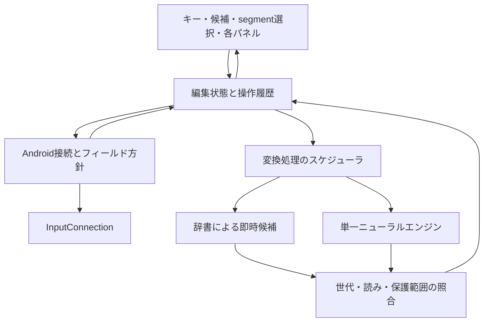

# Phase 0：要求と技術選定案

調査日：2026-09-20。これは実装前の提案であり、性能測定結果や完成済み仕様ではない。資料ごとの根拠・ライセンスは調査文書に記載する。

## 結論

Android IMEの接続と編集を先に安定させ、その上にsegment単位のライブ変換を載せる。製品に載せるニューラルエンジンは一つに絞り、同じ端末・入力条件で既存候補を評価して選ぶ。既存モデルが目標を満たさない場合に追加学習・自作へ進む。「最強」は未測定の段階で断定しない。

基盤の第一評価候補はMozcのAndroid向け変換ライブラリ、ニューラルの着手候補はzenz v3.2 small。jinen等との比較、上位サイズ・量子化による品質差の確認を経て一つを選ぶ。小型モデルや古い端末への対応を守るために、常用時の品質を先に諦める方針ではない。

UI、編集状態、変換処理を分け、IMEが所有するcomposition内で訂正・Undoを保証する。エディタ内の任意の過去文字列を自由に書き換えられることは前提にしない。

## 確定した前提

- 主目的は本人の常用。品質が十分ならOSS・一般公開も検討する。現状のリポジトリ公開状態と、コード・モデルを配布するライセンスの決定は別である。
- 正しい自動変換に対して、Enterや候補選択を毎回要求しない。
- ライブ変換のON/OFF、常時候補バー、明示選択の保護、過去segment訂正を必要とする。
- Android 11/API 30以上を暫定対象とする。性能上必要なら対応下限を上げられる。常用端末の機種・RAMは不明。
- INTERNET権限なしを優先する。通常入力の送信、クラウド推論は行わない。
- 製品のニューラルエンジンは一つ。エンジン切替UIは作らない。比較用実験と製品の構成を区別する。
- 今回は調査・設計まで。SDK導入、アプリ実装、モデル学習、端末実験は次段階で行う。

## 要求の優先順と対象

| 優先 | 対象 | 完了を判断する条件 |
|---|---|---|
| 最優先 | 文字の欠落・二重入力・別フィールドへの書込み防止 | 接続切替と遅延結果の試験に合格する |
| 最優先 | 正しい入力は確定不要、誤変換は局所訂正 | 最終正解率と確定ゼロ率を併記し、保護segmentが勝手に変わらない |
| 必須 | 12-key、英語QWERTY、数字、記号、候補、削除、カーソル、editor action | 実際の編集アプリの互換表に合格する |
| 必須 | ユーザー辞書、意味単位のUndo/Redo | 辞書CRUD・入出力とcomposition内編集の往復を確認する |
| 常用版 | Inline Autofill、Clipboard、絵文字、顔文字、定型文 | OSとproviderの制約を守り、保存・削除・検索の実機検証に合格する |
| 常用版 | 良いデフォルト、背景画像、片手操作、テーマ | 設定なしで使え、変更後もタップ領域・可読性が保たれる |
| 対象外 | AI文章生成、GIF、広告、ニュース、SNS、新語収集運用 | 初期実装へ混ぜない |

## 推奨構成

これは責務の区分であり、同数のmoduleやinterfaceを作る指示ではない。初期は一つのAndroidアプリ内で、UIに依存しない編集状態と変換入口だけを分離する。

| 責務 | 提案 | 理由と不利益 |
|---|---|---|
| IME接続 | KotlinのInputMethodServiceと小さいInputConnection窓口 | 接続・UTF-16・ライフサイクルを集中管理できる。エディタ差は実機検証が必要 |
| キー描画 | 初期は専用Viewを第一案、設定画面はComposeを候補とする | pointer・flick・描画遅延を測りやすい。二つのUI方式を保守する負担あり。短い試作で決める |
| 編集状態 | 順序付けたイベントと純粋な状態遷移 | 非同期結果やUndoの再現試験ができる。Editorの真の状態まで所有はできない |
| 変換 | 即時候補と単一ニューラル改善を内部で統合 | 入力を推論待ちにしない。二段階表示のちらつきを適用条件で抑える必要がある |
| 永続化 | 辞書・定型文・テーマ等の用途別データ | 入力本文・composition・推論文脈を永続化しない。復元できる範囲に制約がある |
| プライバシー | 全依存を含むmerged manifestでINTERNET不在を確認 | 更新は同梱またはファイル導入。自動更新の手軽さを失う |

変換器の具体的な第一候補と代替案は[比較結果](research/conversion-engines.md)に記載する。外部実装のAndroid UIを丸ごと取り込まず、ライセンスと保守負担が見合う変換・辞書・推論部分を評価する。

## 再利用と自作

| 再利用する対象 | 自作する対象 |
|---|---|
| Android標準のIME/Autofill/ファイル選択API | ライブ変換の状態・安定化・訂正・UndoとEditor同期 |
| 採用試験を通った辞書変換・モデル・推論ランタイム | 日本語12-keyの操作と候補・segment選択UI |
| Unicodeデータ、許諾された顔文字・記号データ | 日常利用の評価シナリオと性能計測 |
| 互換性を確認した辞書の入出力仕様 | 外観設定と入力設定を分けたテーマ形式 |

コード・学習済みモデル・辞書・学習データ・同梱画像の許諾を別々に確認する。公開リポジトリで読めることは、再配布してよいことを意味しない。ライセンス不明の資産は採用しない。

## 重要な制約と未決事項

1. **過去segmentのタップ**：標準APIだけではエディタ内の生タップを保証できない。selection連動を補助とし、IME内のsegment一覧を必ず使える訂正入口にする。
2. **Undoの範囲**：最初の保証対象は所有中のcomposition。確定後・外部編集後まで無制限に戻す仕様にはしない。
3. **Credential表示**：IMEはOS/providerのInline Suggestionsを表示する。独自にパスワードやpasskeyを取得せず、すべてのproviderがすべての種類を提示する保証はしない。
4. **Clipboard**：sensitive指定は除外できるが、未指定の秘密を完全に見分けることはできない。自動保存を既定OFFとする案と、秘密保存を完全防止する要求の両立は要確認。Phase 4開始前に決める。
5. **性能**：Androidバージョンだけでは端末能力を決められない。機種・RAM・熱条件を指定した試験後にモデルと対応端末を確定する。
6. **学習**：個人学習のデータ・保持期間・削除・backup除外はPhase 3前に確定する。password/PIN・sensitive・no-personalized-learningで停止する。
7. **ライセンスと公開**：アプリのライセンス、配布経路、モデル再配布条件は依存を固定する前に確定する。未確定のまま第三者コードをコピーしない。

判断待ちの事項は実装採用の前に解決する。調査文書のmergeは、未決の技術やライセンスを採用したことを意味しない。

## 元要求との対応

| 元要求 | 設計・検証への反映 |
|---|---|
| 1–2 コンセプト・ライブ変換 | 状態設計の3状態、hard/soft boundary、Phase 2と無介入正解文率 |
| 3–4 訂正・Candidate Bar | 常時候補、IME内segment選択、selection連動、局所置換・末尾復帰 |
| 5–6 Undo・Backspace | composition内の操作履歴、読みとUTF-16の対応、範囲外の制約 |
| 7 変換エンジン | エンジン比較の全指定軸、単一neural採用試験、追加学習・自作条件 |
| 8 オフライン | INTERNETなし、同梱/ファイル導入、backupと外部Intentの別管理 |
| 9 Password・Autofill | 機密欄で学習等停止、公式Inline Suggestions、provider別の制約 |
| 10 Clipboard | 観測可能な履歴、pin・削除・検索・期限・重複排除、未指定の秘密は未解決 |
| 11 日本語入力 | Phase 1b、flick/long press/repeat/濁点/半濁点/小文字/cursorの試験 |
| 12 Emoji等 | 共通検索、カテゴリ・最近・お気に入り、候補混在は後段評価 |
| 13 ユーザー辞書 | Phase 1のCRUD、Phase 2までの入出力、Mozc TSV互換の検証 |
| 14 定型文 | 明示保存するデータとしてClipboardと保持方針を分離、共通入口 |
| 15–16 UI・Theme | 高さ/幅/片手/キーサイズ・間隔・角丸、候補行高、font、色、透過、背景画像・明度・blur、押下animation・振動・音を段階評価。version付きTheme保存・複製・入出力 |
| 17 Non-goal | 初期のAI文章生成、GIF、SNS、広告、ニュース、流行語収集を除外 |
| 18 UI構成 | toolbar案と候補行統合案の占有率・操作数・発見可能性を実測比較 |
| 19 Android固有 | API調査と計画のEditor/OS/lifecycle/inputType互換マトリクス |
| 20 性能 | 押下/Editor表示/候補/推論を分離計測し、古い結果を拒否 |
| 21 アーキテクチャ | UI・状態・変換の責務を分け、必要以上のmoduleや切替UIを作らない |
| 22–24 開発順・評価・今回の成果 | 基盤MVPとライブMVP、Phase別検証、未測定と採用判断を分離 |
| 25 UXから逆算 | 各upstreamは全部利用・部分利用・参考・非採用の選択肢を維持 |
